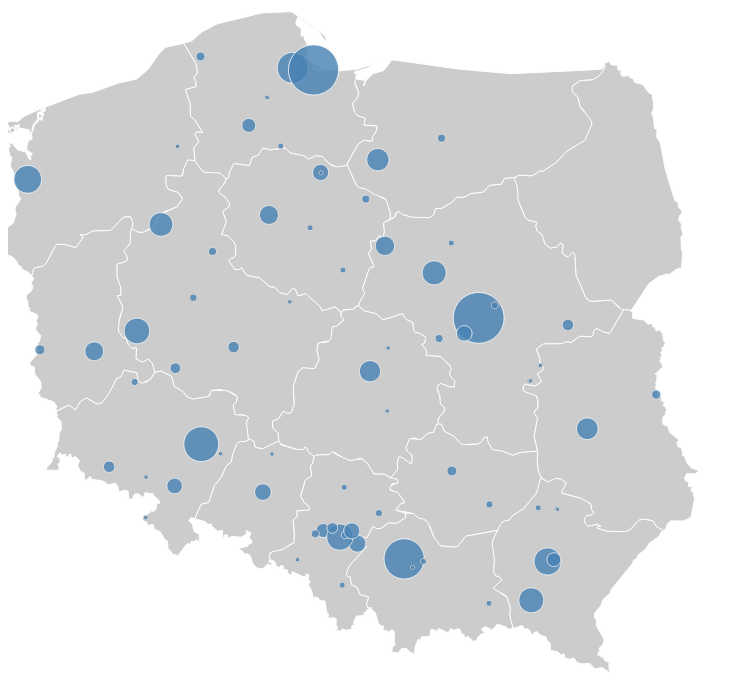

#TASS

Wyszukiwanie geograficzne osób wysoko oceniających określoną książkę na podstawie portalu www.lubimyczytac.pl.

## Przykładowe wyjście programu
Mapa przedstawia ile osób przyczytało książki Terrego Prachetta (i zarazem wysoko je oceniły - to jest powyżej 6 gwiazdek).


## Uruchomienie
* Do uruchomienia wymagane jest pobranie danych o użytkownikach z portalu lubimyczytac.pl. Wymagane jest wcześniejsze zarejestrowanie się na stronie i podanie swojego loginu i hasła w pliku collector.py:
```
my_username = 'YOUR_MAIL@mail.com'
my_password = 'YOUR_PASSWORD'
```Następnie uruchom: ```$ python collector.py```. Pobrane strony internetowe zostaną ściągniete do folderu data/.
* Aby wyekstrahować wymagane dane uruchom ```$ python extractor.py```. Wymagane jest wcześniejsze postawienie bazy danych MongoDB.
* Aby wyszukać ile osób z danego miasta przeczytało daną książkę użyj przykładowych poleceń:
```
$ python query.py -author Terry Pratchet
$ python query.py -title Zmierzch
```
* Postaw serwer HTTP:
```
$ python -m SimpleHTTPServer
```
I wejdź na stronę http://localhost:8000/src/datamap.html.
